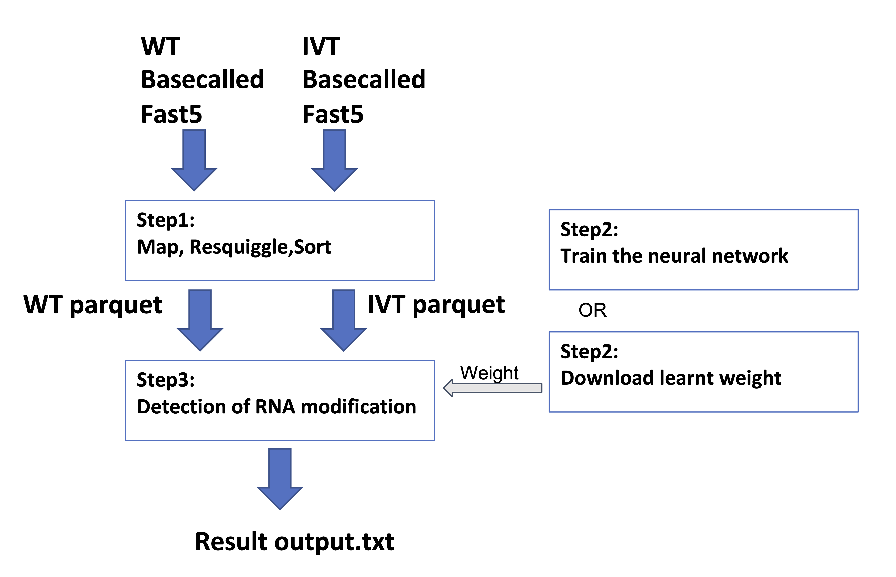
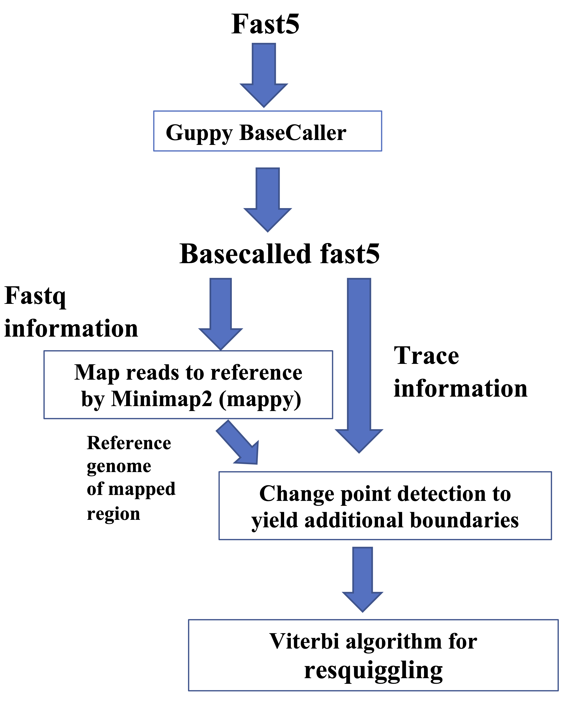
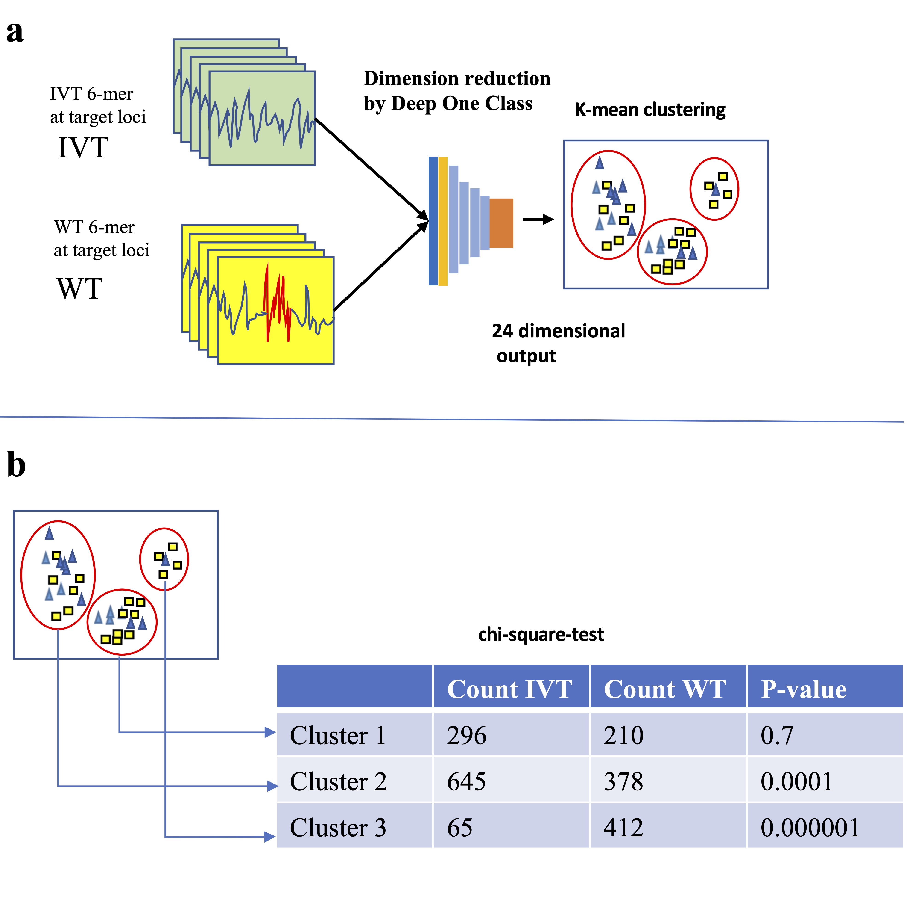
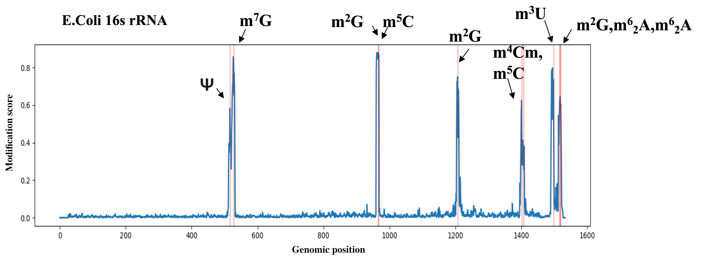
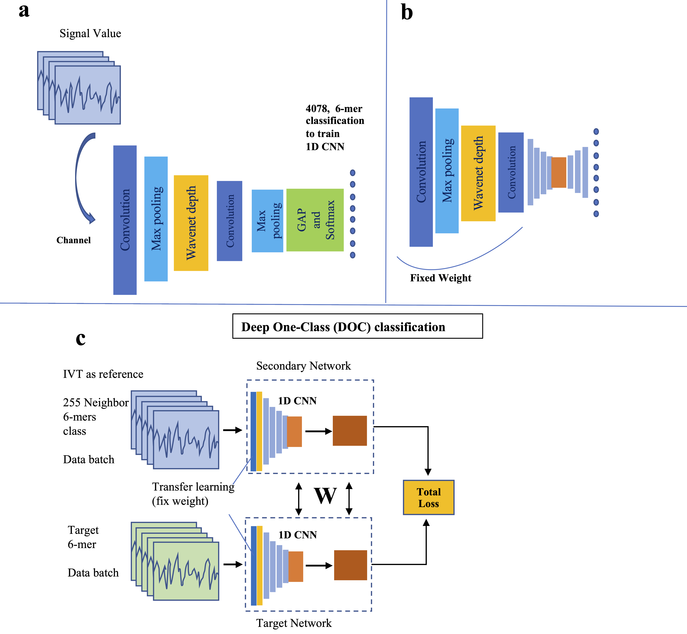

## README

NanoDoc2 is a software to detect multiple types of RNA modification from nanopore direct RNA sequencing data. The nanoDoc2 includes a novel signal segmentation algorithm based on the trace value - a base probability feature that is added by Guppy basecalling program from ONT during processing of the raw signal. The core of nanoDoc2 includes a machine-learning algorithm in which a 6-mer segmented raw current signal is analyzed by Deep-One-Class classification using a WaveNet-based neural network. As an output, an RNA modification is detected by a statistical score in each candidate position.

The software nanoDoc2 consists of three parts, the first part is sequence to signal assignment (or resquiggling), the second part is training using Deep-One-Class Algorithm and the third part is detection of RNA modification using neural network and clustering algorithms. A typical user can use only the first and third part to detect RNA modification with parameters from the learned model obtained from the second part.



### Computational Environment

To detect RNA modification using learned weight, a Linux machine with more than 20GB GPU memory (VRAM) with multiple CPU cores is required. However, for training a nanoDoc2 neural network, a GPU with at least 50GB memory (VRAM) (in total) is required. Moreover, following software are required to be installed:

1. Guppy basecaller (version 6.1.2): Guppy basecaller is available on ONT website to the members of the ONT community. One should run Guppy basecaller with fast5 output option ‘- fast5_out’.
2. Minimap2 -  for pairwise alignment between nucleotide sequences. See [https://github.com/lh3/minimap2.git]().
3. Tensorflow (2.5.2) with Cuda (11.2) + CuDNN (8.1) in Python (3.6) environment is tested.

For other details, see *requirement* file.

### Data preparation

First nanodoc2 uses Viterbi decoding to resquiggle the raw signal using trace data. To assist Viterbi first a genome aligner is used to map each raw signal to one of the reference sequences by using basecalled sequences. After decoding each raw signal is sorted according to the genomic position of the reference sequence and normalized against the theoretical current value using least mean square approach. The theoretical current values are obtained from ONT provided 5-mer models given in the sites ([https://github.com/nanoporetech/kmer_models]())The output of the resquiggling and sorting step is an [Apache parquet](https://parquet.apache.org/) format which will be used in the subsequent steps.



### Installation and preparation of nanodoc2

Execute following commands to get a source from github, install required library, and download prepackaged learned weight for 6-mer. We recommend using a python virtual environment to install nanodoc2. The learned weights for 6-mer need to be downloaded from the link of [ZENODE](https://zenodo.org/]), as described below. In order to run nanodoc2 one also requires experimental long-read data for the sample of interest that include modification as well as unmodified IVT data.

To install nanoDoc2 and pre-required python libraries, execute the following command:

```shell
$ git clone https://github.com/uedaLabR/nanoDoc2.git  
$ cd nanoDoc2/src
$ python3 -m venv venv3
$ source venv3/bin/activate
(venv3) $ pip install --upgrade pip
(venv3) $ pip install -r requirements.txt
```

To download the pre-learned weight, execute the following command:

```bash
(venv3) $ cd ..
(venv3) $ mkdir weight6mer
(venv3) $ cd weight6mer
(venv3) $ wget https://zenodo.org/record/6583336/files/weight_A.tar.gz .
(venv3) $ wget https://zenodo.org/record/6586529/files/weight_T.tar.gz .
(venv3) $ wget https://zenodo.org/record/6587256/files/weight_C.tar.gz .
(venv3) $ wget https://zenodo.org/record/6588796/files/weight_G.tar.gz .
(venv3) $ tar -zxvf ./weight_A.tar.gz
(venv3) $ tar -zxvf ./weight_T.tar.gz
(venv3) $ tar -zxvf ./weight_C.tar.gz
(venv3) $ tar -zxvf ./weight_G.tar.gz
(venv3) $ rm -r ./weight_*.gz
(venv3) $ cd ../nanoDoc2
```

### Inferring by nanodoc2 using previously trained model

The inference workflow can be split into three steps. First, we need to prepare properly segmented data by using genomic mapper (based on experimental basecalled nanopore data) like Minimap2 followed by Viterbi resquiggling algorithm. Then segmented experimental long-read and IVT data are fed to the DOC classifier. All output from experimental and IVT data for a fixed genomic location are then compiled to a list of outputs, which is then subjected to k-means clustering in the third step. This clustering is repeated for each genomic location. The presence of modification at a genomic location is deduced by analyzing the biases of abundance of IVT or experimental data in clusters which is converted to a modification score. To visualize the prediction of modification, one can plot such scores to generate a modification probability plot.





Issue following command for mapping reads to the reference and segmentation:

```bash
python ./nanoDoc.py fast5ToReSegmentedPq 					\
			-i /path/to/multifast5							\
			-o /path/to/out/out1.pq 						\
			-r /path/to/out/ref.fa 							\
			-fm /path/to/fmer_current						\
			-t 5 -qv 5										\
			-mo 12 10 30 20
```

where,<br>-i input directory containing multifast5 files, multifast5 is recursively searched under this directory<br>-o output directory where parquet file output will be written,<br>-r reference file in fasta format,<br>-fm theoretical k-mer model file<br>-t number of thread to use (default value is 12, optional),<br>-qv average q-value threshold for basecall quality (default value is 5, optional). The reads with average q-value below this threshold will not be used in the analysis.<br>-mo mappy option (default values is tuple of (12,10,30,20), optional), where each value in the tuple corresponds to mappy options of ‘k’,’w’,’min_chain_score’,’min_dp_score’, respectively.<br>

Repeat the procedure for the experimental sample of interest and unmodified IVT sample.<br>This will take 6-10 hours of execution time in this example. <br>

For modification detection run following command:

``` bash
python ./nanoDoc.py analysis 							\			
			-w /path/to/weight 							\
			-r /path/to/ref								\				
			-rpq /path/to/IVT parquet file				\	
			-tgpq /path/to/target parquet file			\
			-o /path/to/output result file				\
			-tsid ecoli16s  							\
			-s 1 -e 1600 -minreadlen 200
```

where,<br>-w learned weight file,<br>-r reference sequence file in Fasta format,<br>-rpq directory of IVT parquet file  created by “fast5toresegmentedpq” command,<br>-tgpq directory of WT parquet file created by “fast5toresegmentedpq” command,<br>-o result text file output<br>-tsid transcript id, name of transcript in the Fasta file<br>-s start position, -e end position,<br>		-minreadlen minimum read length used in the analysis. (default value is 200, optional)<br>

This will take a few hours of execution time depending on the size of the transcript.

The output from nanodoc2 contains 5 columns: position or genomic position, 6-mer, IVT depth, WT depth and score, where IVT and WT depth refers to the number of reads used for analysis from IVT and WT data, respectively. It can be plotted by:

```bash
python ./nanoDoc.py plotGraph 					\
 			-f /path/to/result file				\
 			-o /path/to/output.png				\
 			-a /path/to/known-site				\
 			-s 16 4
```

where,<br>-f result text file generated by “analysis” command,<br>-o output file in png format, which if omitted “result.png” file will be created in the same folder as the input file,<br>-a file containing a list of known modification sites for annotation purposes. (optional),<br>		-s size of output graph in (X,Y), where X is size in x axis and Y is y-axis (default value is (16,4), optional)<br>

### Training nanodoc2 for IVT data

This section explains how to train the nanodoc2 DOC classifier. For this we need IVT long-read data that is mapped and resquiggled by following the procedure described above. The output of the preparation phase is a parquet file, which now will be fed to a script to make 6-mer data. After that, actual DOC training will be performed.



Use the following script to prepare 6-mer data from the IVT data already obtained for initial training:

```bash
python ./nanoDocPrep.py make6mer			\
			-r /path/to/reference file		\
			-p /path/to/parquet file		\
			-o /path/to/output 				\
			-j False						\
			-takeCnt 1200
```

where,<br>		-r path to reference file, fasta format (can be multiple),<br>		-p path to parquet file (can be multiple),<br>		-o path to output,<br>-j if True, output will be merged into one file (default False)<br>-takeCnt read counts for each 6mer.

An example of this data preparation step is as follows:

```bash
python ./nanoDocPrep.py make6mer										\
			-r /path/to/ref1.fa  -r /path/to/ref2.fa					\
			-p /path/to/parquet1.pq  -p /path/to/parquet2.pq -j True	\
			-o  /path/to/init_train6mer.pq	-takeCnt 1200
```

The Network is pre-trained before actual DOC classification with weight sharing. For this we need to prepare an initial 6-mer dataset separately:

```bash
python ./nanoDocPrep.py make6mer										\
			-r /path/to/ref1.fa -r /path/to/ref2.fa						\
			-p /path/to/parquet1.pq -p /path/to/parquet2.pq				\
			-o /path/to/inittrain.pq									\
			-j True -takeCnt 1200
```

Note that DOC architecture includes two Wavenet-based neural networks. To save time for loading data, make two 6-mer datasets where each 6-mer reads are saved in an independent file - one for the target network and another for the secondary network. See below:

For the target network,

```bash
python ./nanoDocPrep.py make6merEach									\
				-r /path/to/ref1.fa  -r /path/to/ref2.fa				\
				-p /path/to/parquet1.pq -p /path/to/parquet2.pq			\
				-o  /path/to/doctrain1 -takeCnt 12750
```

For the secondary network,

```bash
python ./nanoDocPrep.py make6merEach									\
				-r /path/to/ref1.fa -r /path/to/ref2.fa					\
				-p /path/to/parquet1.pq -p /path/to/parquet3.pq			\
				-o /path/to/doctrain2 -takeCnt 50
```

Therefore, we split our input data into three parts, one will be used for pre-training, and the other two will be used for actual DOC classification. This will take a few hours of execution time depending on the size of the transcript.

***Pre-training model for 6-mer classification***

Pre-train the Wavenet network in two steps. In the first step, featurize each input signal from a 6-mer to one of the 4078 classes. These 4078 numbers of classes are close to all possible 4^6 classes. This is done by issuing the following command, which runs the optimizer for 100 epochs.

```bash
python ./nanoDocPrep.py traincnn					\
				-i path/to/init_train6mer.pq		\
				-o /path/to/outputweight			\
				-epoches 100						\
				-device /GPU:0
```

This will take about 12 hours of execution time using two Nvidia A100 GPUs.

In the next step, train the Wavenet network by stacking an encoder-decoder at the end (for 50 epochs in this case). Note that during this phase the layers already trained above are not trained further (transfer learning approach). After this, throw away the decoder part and use encoder-fused Wavenet as our DOC classifier. This dimensionality reduction is done via:

```bash
python ./nanoDocPrep.py traincnnAdd					\
				-i /path/to/init_train6mer.pq		\
				-inw /path/to/inweight	_dir		\
				-o /path/to/outputweight_dir2		\
				-epoches 200						\
				-device /GPU:0
```
where, -inw, “inweight_dir” is the “outputweight_dir” in the previous “traincnn” command.<br>
This will take about 24 hours of execution time using two Nvidia A100 GPUs.

***Deep-One-Class classification for each 6-mer***

After initial training of the DOC classifier network two instances of such a network were coupled and fed by the dataset prepared for the target and secondary networks. This training is performed via shared weight between the networks. Use following command to do this:

```bash
python ./nanoDocPrep.py traindoc			\
			-d1 /path/to/inittrain2.pq		\
			-d2 /path/to/inittrain3.pq		\
			-o /path/to/output_weightdir	\
			-inw /path/to/inweight	_dir	\
			-ssize 12750					\
 			-epoches 3						\
			-device /GPU:0
```

where,<br> where -inw “inweight_dir” is the “outputweight_dir2” in the previous “traincnnadd”   command, and -ssize is the number of reads for each 6-mer used in DOC training (default 12750).

The output weights of this training are saved and later used for inference (as discussed in the above). This will take about 48 hours of execution time using two Nvidia A100 GPUs.

<u>**Notes**</u>

1. Most updated versions of TensorFlow and Cuda can be used even though they are not tested. Keras 2.3 is also required in addition to TensorFlow for the reason that Keras library is required to build a joint network used in doc training.
2. Reference sequence used in this study are deposited in the GitHub repository.
3. The k-mer model downloaded from the link: [https://github.com/nanoporetech/kmer_models/blob/master/r9.4_180mv_70bps_5mer_RNA/template_median69pA.model]()
3. Minimap2 parameters can be loosened for heavily modified RNA sequences.<br>Parameters for minimap can be set in the "-mo" option in the ‘fast5ToReSegmentedPq’ command described above. One could decrease those parameters if RNA is basecalled with a lot of error caused by heavy modifications.
4. Current version is only applicable to plus strand, i.e. users need to prepare transcript sequence as a reference.
5. Method *does not have single-base resolution*. **±1 position should also be considered** as a candidate for modification sites.
